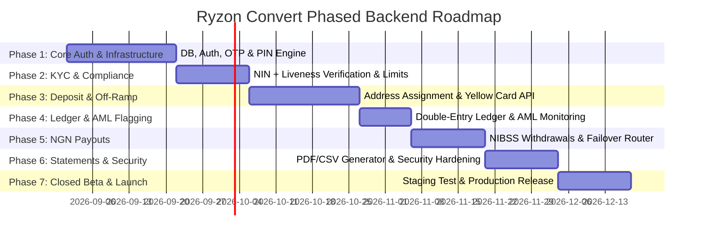

# Production Launch Plan: Phased Feature-by-Feature Backend Specification

This document details the feature-by-feature backend architecture for **Ryzon Convert**, aligned with the locked specifications in `ryzon-flow-spec.md` and `ryzon-production-launch-plan-aligned.md`.

> [!IMPORTANT]
> **Core Architectural Model**: RYZON does **not** custody user crypto or run an internal HD treasury. **Yellow Card** (a licensed third-party off-ramp) executes the crypto-to-Naira conversion. RYZON's backend orchestrates deposit monitoring, calls Yellow Card's conversion API, records double-entry ledger bookings, and executes NGN payouts to Nigerian bank accounts.

---

## 🔑 Comprehensive Master List of Required API Keys & Services

Before starting development on each phase, the following accounts, credentials, and API keys must be provisioned:

| Category | Provider / Service | Required API Keys & Credentials | Required Environment Variables |
|---|---|---|---|
| **Database & Cache** | PostgreSQL / Supabase / Neon | DB Connection String, Credentials | `DATABASE_URL`, `DB_POOL_SIZE` |
| **Cache & Idempotency** | Redis / Upstash | Redis Host, Port, Password | `REDIS_URL`, `REDIS_PASSWORD` |
| **Authentication** | JWT & Security Secrets | Random 256-bit Hex Secrets | `JWT_ACCESS_SECRET`, `JWT_REFRESH_SECRET`, `PIN_HMAC_SECRET` |
| **SMS OTP** | Termii / Twilio | API Key, Sender ID, Account SID | `TERMII_API_KEY`, `TERMII_SENDER_ID` |
| **Email OTP / Alerts** | SendGrid / Resend / Mailgun | SendGrid API Key, Sender Email | `SENDGRID_API_KEY`, `SENDER_EMAIL_ADDRESS` |
| **KYC & Liveness** | Smile ID (or Dojah / Prembly) | Partner ID, API Key, Environment | `SMILE_ID_PARTNER_ID`, `SMILE_ID_API_KEY`, `SMILE_ID_ENV` |
| **Crypto Off-Ramp** | Breet API | Application ID, Secret, Webhook Secret, Markup Config | `BREET_APP_ID`, `BREET_APP_SECRET`, `BREET_WEBHOOK_SECRET`, `BREET_ENV` |
| **Blockchain Indexing** | Alchemy / QuickNode / Tatum | RPC Node API Keys for BSC, Arbitrum, Plasma | `ALCHEMY_BSC_KEY`, `ALCHEMY_ARBITRUM_KEY`, `PLASMA_RPC_URL` |
| **NGN Payouts** | Monnify / Korapay / Paystack | API Key, Secret Key, Contract Code, Wallet ID | `MONNIFY_API_KEY`, `MONNIFY_SECRET_KEY`, `KORAPAY_SECRET_KEY` |
| **Object Storage** | AWS S3 / Cloudflare R2 | Access Key ID, Secret Access Key, Bucket Name | `AWS_ACCESS_KEY_ID`, `AWS_SECRET_ACCESS_KEY`, `AWS_S3_BUCKET` |
| **Push Notifications** | Firebase Cloud Messaging (FCM) | Firebase Service Account Private Key JSON | `FIREBASE_SERVICE_ACCOUNT_KEY` |
| **Compliance & Monitoring**| Sentry / Slack Webhook | DSN URL, Compliance Channel Webhook | `SENTRY_DSN`, `SLACK_COMPLIANCE_WEBHOOK_URL` |

---

## 🗺️ Master Phased Roadmap

---

## 🚀 Feature-by-Feature Detailed Specifications

### PHASE 1: Core Infrastructure & Auth Engine (Weeks 1–3)

#### 🔹 Feature 1.1: Database Schema & Migration Engine
- **Logic**: Establish PostgreSQL relational schema with migration scripts (Prisma / TypeORM / Drizzle / Goose).
- **Prerequisites**: PostgreSQL instance, Redis instance.
- **Env Keys Needed**: `DATABASE_URL`, `REDIS_URL`.

#### 🔹 Feature 1.2: User Registration & JWT Session Management
- **Logic**: User registration, password hashing via `Argon2id`, JWT Access (15-min TTL) & Refresh Token (30-day TTL) issuance and rotation.
- **Prerequisites**: JWT Secrets.
- **Env Keys Needed**: `JWT_ACCESS_SECRET`, `JWT_REFRESH_SECRET`.

#### 🔹 Feature 1.3: Multi-Channel OTP Engine (Email & SMS)
- **Logic**: Generate 6-digit OTPs cached in Redis (5-min expiry). Deliver via SMS (Termii) or Email (SendGrid). Rate-limit to 5 requests per hour.
- **Prerequisites**: Termii Merchant Account, SendGrid Account.
- **Env Keys Needed**: `TERMII_API_KEY`, `TERMII_SENDER_ID`, `SENDGRID_API_KEY`, `SENDER_EMAIL_ADDRESS`.

#### 🔹 Feature 1.4: 4-Digit Security PIN Engine
- **Logic**: Set & verify 4-digit transaction PIN stored as HMAC-SHA256 hash. Enforce 3-strikes lockout (15-minute cooldown) on wrong PIN entries.
- **Prerequisites**: PIN Secret Key.
- **Env Keys Needed**: `PIN_HMAC_SECRET`.

#### 🔹 Feature 1.5: Password Reset Flow (Forgot Password)
- **Logic**: Validate OTP token -> issue short-lived Password Reset Token -> update password in DB -> revoke existing JWT sessions.
- **Prerequisites**: SendGrid Email Templates.

---

### PHASE 2: KYC Compliance — Tier 1 + Liveness Check (Weeks 4–5)

#### 🔹 Feature 2.1: Instant NIN Verification Integration
- **Logic**: Submit 11-digit NIN to Smile ID / Dojah API. Verify returned first name, last name, and date of birth match user registration profile.
- **Prerequisites**: Smile ID Partner Account & API Credentials.
- **Env Keys Needed**: `SMILE_ID_PARTNER_ID`, `SMILE_ID_API_KEY`, `SMILE_ID_ENV`.

#### 🔹 Feature 2.2: Selfie / Liveness Anti-Spoofing Capture
- **Logic**: Execute Smile ID SmartSelfie / Liveness check to confirm human presence and face match against NIN photo. Allow up to 3 retries before requiring support intervention.
- **Prerequisites**: Smile ID Liveness SDK / Webhook endpoint.

#### 🔹 Feature 2.3: Async KYC Webhook Handler
- **Logic**: Process async status callbacks from identity provider for long-running verification jobs.
- **Prerequisites**: Public HTTPS webhook domain.
- **Env Keys Needed**: `KYC_WEBHOOK_SECRET`.

#### 🔹 Feature 2.4: Daily Withdrawal Limit Enforcement (₦500,000 Cap)
- **Logic**: Middleware checking rolling 24-hour withdrawal sum in Redis. Tier 1 accounts limited to ₦500,000/day for withdrawals. Deposit/conversion side remains uncapped.

---

### PHASE 3: Deposit Address Assignment & Breet Off-Ramp Integration (Weeks 6–8)

#### 🔹 Feature 3.1: Breet API & Authentication Integration
- **Logic**: Interface with Breet REST API (`https://api.breet.io/v1`) using `x-app-id`, `x-app-secret`, and `X-Breet-Env` headers for deposit address generation, rate calculation, bank payouts, and trade webhooks.
- **Prerequisites**: Breet Account & Developer Credentials.
- **Env Keys Needed**: `BREET_APP_ID`, `BREET_APP_SECRET`, `BREET_ENV`, `BREET_WEBHOOK_SECRET`.

#### 🔹 Feature 3.2: Dual Settlement Mode (User Preference Toggle)
- **Logic**: User can select between:
  - **Auto-Settlement**: Incoming deposits automatically convert and payout to linked NGN bank account.
  - **Manual Settlement**: Incoming deposits convert to NGN and credit internal Ryzon wallet for manual payout.
- **UI Integration**: Toggle added to User Settings Screen & Deposit Screen.

#### 🔹 Feature 3.3: Permanent Wallet Address Generation & Asset Management
- **Logic**: Invoke `POST /v1/trades/sell/assets/{ASSET_ID}/generate-address` per user per asset. Pass `label: "user-{userId}"` and user's linked NGN bank account when auto-settlement is ON.

#### 🔹 Feature 3.4: Real-time Rate Calculator & Revenue Markup Engine
- **Logic**: Query `GET /v1/rates/calculator` for live crypto-to-NGN conversion rates. Compute Ryzon revenue markup: `1% of conversion amount, capped at ₦50`.

#### 🔹 Feature 3.5: Breet Webhook Receiver & Sandbox Testing
- **Logic**: Receive `trade.completed` webhooks. Execute `POST /v1/trades/mock` in sandbox to simulate on-chain deposits without real crypto.

---

### PHASE 4: Double-Entry Ledger & AML Monitoring (Weeks 9–10)

#### 🔹 Feature 4.1: Double-Entry Accounting Ledger
- **Logic**: PostgreSQL immutable double-entry ledger. Record every conversion with exact Yellow Card exchange rate, fee applied, crypto amount, and NGN credited balance.
- **Prerequisites**: Database schema migration for ledger tables.

#### 🔹 Feature 4.2: Large Deposit AML Monitoring & Flagging
- **Logic**: Silent internal trigger on single deposits >= ₦1,000,000 – ₦2,000,000. Send automated alert to compliance Slack/PagerDuty channel for ops review without blocking user flow.
- **Prerequisites**: Slack Webhook URL / Sentry DSN.
- **Env Keys Needed**: `SLACK_COMPLIANCE_WEBHOOK_URL`, `SENTRY_DSN`.

---

### PHASE 5: Instant NGN Payout & Banking Engine (Weeks 11–12)

#### 🔹 Feature 5.1: Bank Account Name Resolver
- **Logic**: Query Paystack / Monnify / Korapay API with account number + 3-digit bank code. Verify resolved account name matches verified user name.
- **Prerequisites**: Monnify / Paystack Merchant Account.
- **Env Keys Needed**: `MONNIFY_API_KEY`, `MONNIFY_SECRET_KEY`, `MONNIFY_CONTRACT_CODE`.

#### 5.2: Instant NIBSS NGN Withdrawal Execution
- **Logic**: Process NGN payouts from platform float account to user bank account. Apply flat **₦20 withdrawal fee**.
- **Prerequisites**: Funded Merchant Payout Float Account.

#### 🔹 Feature 5.3: Idempotency & Payout Failover Router
- **Logic**: Generate strict idempotency key (`withdrawal_id + user_id`). If Provider A (Monnify) fails, automatically retry transfer through Provider B (Korapay).
- **Env Keys Needed**: `KORAPAY_SECRET_KEY`.

---

### PHASE 6: Statement Export, Notifications & Security Hardening (Weeks 13–14)

#### 🔹 Feature 6.1: PDF & CSV Statement Generator Microservice
- **Logic**: Generate branded PDF (Puppeteer / PDFKit) and CSV account statements for specified date range. Upload to AWS S3 and email secure download link to user.
- **Prerequisites**: AWS S3 Bucket & IAM Credentials.
- **Env Keys Needed**: `AWS_ACCESS_KEY_ID`, `AWS_SECRET_ACCESS_KEY`, `AWS_S3_BUCKET`, `AWS_REGION`.

#### 🔹 Feature 6.2: Push & Email Notification Service
- **Logic**: Send FCM push notifications ("Deposit Received! ₦760,000 credited") and transactional emails for completed withdrawals.
- **Prerequisites**: Firebase Project & Service Account Key.
- **Env Keys Needed**: `FIREBASE_SERVICE_ACCOUNT_KEY`, `SENDGRID_API_KEY`.

#### 🔹 Feature 6.3: Cloudflare WAF & Security Hardening
- **Logic**: Configure DDoS protection, Cloudflare Web Application Firewall, IP rate-limiting on sensitive endpoints, and TLS 1.3 encryption.

---

### PHASE 7: Closed Beta & Production Rollout (Weeks 15–16)

#### 🔹 Feature 7.1: Staging Environment & E2E Integration Testing
- Execute live small-value test deposits and NGN payouts on staging.

#### 🔹 Feature 7.2: Production Rollout & Mobile App Launch
- Deploy backend to production cluster (AWS EKS / Render / GCP), submit iOS App Store & Android Play Store builds.

---

## 📋 Summary Checklist of Things to Prepare / Obtain Now

Before code execution starts, please prepare:
1. **Yellow Card Merchant Account & API Keys** (Essential for Phase 3 deposit conversion).
2. **Smile ID / Dojah Account & API Keys** (Essential for Phase 2 NIN + Liveness).
3. **Monnify & Korapay Merchant Accounts** (Essential for Phase 5 bank resolution & NGN payouts).
4. **Termii & SendGrid Accounts** (Essential for Phase 1 SMS & Email OTP).
5. **AWS S3 Account & Firebase Project** (Essential for Phase 6 statements & push notifications).
