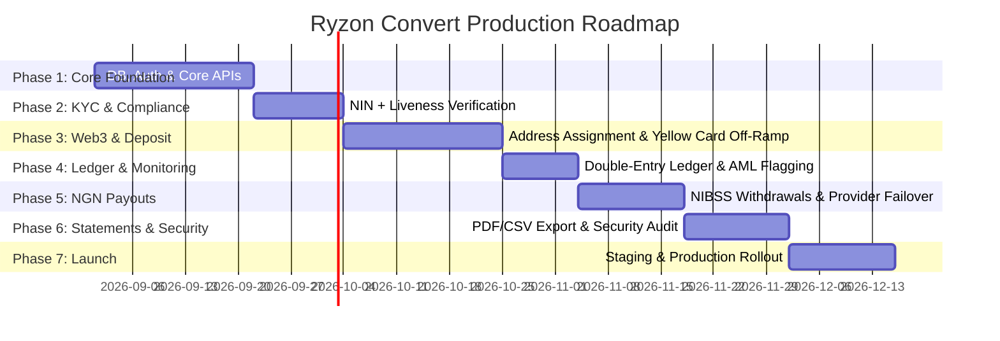

# Production Launch Plan: Phased Backend Architecture & Roadmap (Aligned to Locked Spec)

**Note:** This is a revision of the original plan you shared, corrected to match what's locked in `ryzon-flow-spec.md`. Key changes are flagged inline with ⚠️ where the original diverged. The biggest structural change: **RYZON does not custody crypto or run its own HD wallet/treasury system.** Yellow Card (a licensed third-party off-ramp) executes the actual crypto-to-fiat conversion. RYZON's backend orchestrates — it detects deposits, calls Yellow Card's API, and credits the user's Naira wallet. This keeps RYZON out of custodial/VASP-style licensing territory, per your locked regulatory posture.

---

## 🗺️ Master Phased Roadmap

---

## 🚀 Detailed Phase Breakdown

### Phase 1: Core Foundation & API Infrastructure (Weeks 1–3)
**Goal**: Establish production database, authentication, user management, and API gateway layer.

*(Unchanged from original — this phase is architecture-agnostic to the custody question.)*

- **Tasks**:
  - Provision PostgreSQL (Primary Database) + Redis (Cache & Idempotency Store).
  - Deploy API Gateway (Rate Limiting, CORS, WAF rules, JWT verification middleware).
  - Implement **Auth Microservice**:
    - User Registration & Email/Phone OTP Verification.
    - Password hashing using `Argon2id`.
    - Transaction PIN hashing using HMAC-SHA256.
    - JWT Access Token issuance + Refresh Token rotation.
    - Password Reset flow (`/auth/forgot-password` & `/auth/reset-password`).
  - Wire Flutter mobile app to real authentication REST endpoints.
- **Deliverables**: Functional Auth API, DB migrations, fully connected Flutter login/signup flow.

---

### Phase 2: KYC Compliance — Tier 1 + Liveness Check (Weeks 4–5)
**Goal**: Automate instant Tier 1 identity verification with liveness detection. ⚠️ **Still no multi-tier system at launch** — original plan's Tier 0–3 structure with document upload is out of scope. Liveness check is now included as part of Tier 1, via a third-party provider, per your update.

- **Tasks**:
  - Integrate Identity Provider API (Smile ID / Dojah / Identitypass, or a dedicated liveness-only provider like FaceTec if the NIN provider doesn't bundle liveness) for:
    - NIN validation.
    - **Liveness check** (selfie/facial capture, anti-spoofing) — confirm whether your chosen provider bundles this with NIN validation in one call, or whether it's a separate integration/second provider. This affects both the API contract and the KYC UI flow (may need a camera-permission + selfie-capture screen added to onboarding, which wasn't in the original Stitch UI prompt).
  - Implement **KYC Service**:
    - Tier 1 endpoint: NIN validation + liveness check, both required to pass before an account is fully verified. No document upload (passport/voter's card/utility bill) at launch — that's still Tier 2/3, deferred.
    - Verification Webhook Listener (async status callbacks) — needs to handle both NIN and liveness results, which may arrive from different providers/at different times if not bundled.
    - Withdrawal limit middleware: ₦500,000 daily cap, Tier 1 only. Deposit-conversion remains uncapped.
  - **Failure/retry handling:** liveness checks have a real false-rejection rate (lighting, camera quality, etc.) — define a retry flow (e.g. up to 3 attempts before requiring support intervention) rather than a hard one-shot pass/fail.
- **Deliverables**: Instant Tier 1 verification flow in Flutter app including selfie/liveness capture screen, admin verification dashboard showing both NIN and liveness status. Higher-tier (document upload) infrastructure explicitly deferred.

---

### Phase 3: Deposit Address Assignment & Yellow Card Off-Ramp Integration (Weeks 6–8)
**Goal**: Assign each user a personal deposit address and auto-convert incoming deposits via Yellow Card. ⚠️ **This phase is substantially different from the original plan** — no custodial HD wallet system, no Fireblocks/BitGo/AWS KMS treasury, no hot-to-cold vault sweep. RYZON does not hold user crypto at any point.

- **Tasks**:
  - On user signup, auto-generate and assign a personal EVM deposit address per user (via Yellow Card's address-issuance API if they provide one, or a lightweight non-custodial address-generation service if RYZON needs to generate addresses itself — **confirm with Yellow Card which model their integration supports before building this**).
  - **Supported assets/networks (locked): USDT and USDC only, on BSC, Ethereum-Arbitrum, and Plasma.** ⚠️ Polygon, Solana, and Tron are out of scope — do not build address derivation or indexing for these networks.
  - Implement **Blockchain Event Listener**:
    - Webhook or polling integration (Alchemy/Tatum/QuickNode, or whatever Yellow Card's integration requires) for deposit detection on the three supported networks only.
    - Confirmation threshold tuned for **speed over reorg-safety** (locked decision) — use minimal safe confirmation counts per chain, not conservative/slow defaults.
  - On detection, call **Yellow Card's conversion API** to execute the crypto-to-Naira conversion. RYZON's backend never custodies the crypto — funds move from the user's assigned address directly through Yellow Card's off-ramp.
  - **Wrong-asset/wrong-chain handling (locked, deferred):** if a deposit arrives that isn't USDT/USDC on the three supported networks, do **not** attempt auto-recovery, auto-sweep, or auto-refund. Detect it, hold it, flag it to a support/ops queue, and notify the user their funds are safe and under review. Build nothing more sophisticated than this at launch.
  - **Provider-down fallback:** if Yellow Card's API is unavailable, hold the detected deposit in a pending state, notify the user their deposit is safe and will convert once service resumes, and retry/queue the conversion call. No secondary off-ramp provider at launch (failover deferred to a later phase, per locked decision).
- **Deliverables**: Dynamic deposit address & QR code generation per user (three supported networks only), live on-chain deposit detection, working Yellow Card conversion integration, defined pending/failure states for wrong-asset and provider-down scenarios.

---

### Phase 4: Conversion Ledger & AML Monitoring (Weeks 9–10)
**Goal**: Record every conversion accurately and flag unusually large activity. ⚠️ Original plan's "Live FX Rate Engine" (Binance P2P/Bybit aggregation, RYZON-set spread) is **not part of the locked model** — Yellow Card sets the conversion rate, RYZON does not run its own rate engine or take a spread on conversion.

- **Tasks**:
  - Implement **Double-Entry Financial Ledger (PostgreSQL)**:
    - Immutable Debit/Credit transaction booking for every deposit conversion and withdrawal.
    - Record the exact rate and fee **Yellow Card applied** at conversion time (for transparency and dispute resolution — locked requirement, since there's no user-facing quote/confirm step before conversion).
    - Naira wallet balance updating on conversion success.
  - Implement **AML deposit monitoring**:
    - Silent internal flag threshold on large single deposits (recommended ₦1M–₦2M range — confirm exact figure with a compliance advisor before launch). This applies to the **uncapped deposit side**, independent of the ₦500k withdrawal limit.
    - Flag triggers internal review only — no user-facing delay or blocking.
    - Optional: Chainalysis/Elliptic address screening can sit here if budget allows at launch, or move to Phase 6 alongside other security hardening.
- **Deliverables**: Audit-ready double-entry transaction database, working large-deposit flagging pipeline.

---

### Phase 5: Instant NGN Payout & Banking Engine (Weeks 11–12)
**Goal**: Automated instant payouts to any Nigerian bank account, respecting the ₦500k daily withdrawal cap. Mostly unchanged from original.

- **Tasks**:
  - Integrate Payout Gateway API(s) (Monnify / Korapay / Paystack / Squad) — single provider acceptable at launch, per locked "no redundancy yet" decision on the deposit side; apply the same reasoning here unless you want payout-side redundancy sooner.
  - Implement **Payout Microservice**:
    - **Bank Resolver**: validate account number + bank code, return official account name (needed for the KYC-name-match fraud check flagged in the withdrawal flow spec).
    - **NIBSS Instant Payout** trigger.
    - **₦500,000 daily limit enforcement**, tracked per user per day, with clear remaining-allowance calculation exposed to the app.
    - **Flat ₦20 withdrawal fee** applied and shown to the user before confirmation. ⚠️ Original plan didn't specify a fee model — this is the locked mechanism, not a rate spread.
    - **Idempotency Engine**: `idempotency_key = withdrawal_request_id + user_id` to guarantee zero duplicate payouts.
- **Deliverables**: Instant NGN withdrawals landing in bank accounts, limit and fee correctly enforced and disclosed.

---

### Phase 6: Statement Export, Notifications & Security Hardening (Weeks 13–14)
**Goal**: Produce account statements, send transactional notifications, complete security audits. Largely unchanged from original — this phase was already well-aligned.

- **Tasks**:
  - Implement **Statement Export Microservice**:
    - PDF Document Generator (PDFKit/Puppeteer, branded RYZON template).
    - CSV Spreadsheet Exporter.
    - Direct email delivery with secure download links (locked "email me my statement" requirement) via AWS S3.
    - No web dashboard — export/email are the only statement delivery mechanisms (locked decision).
  - Implement **Notification Microservice**:
    - Push Notifications via FCM (critical for the "incoming deposit detected" flow, since deposits are detected passively without the user in-app).
    - Email Alerts via SendGrid/Mailgun for deposit receipts & payouts.
  - **Security & Compliance Auditing**:
    - Penetration testing & vulnerability assessment.
    - Chainalysis/Elliptic AML screening (if not already built in Phase 4).
    - Cloudflare WAF, IP rate limiting, DDoS protection.
- **Deliverables**: Functional statement export flow in Flutter app, fully audited security setup.

---

### Phase 7: Closed Beta & Production Rollout (Weeks 15–16)
**Goal**: End-to-end testing, staging validation, public launch. Unchanged from original.

- **Tasks**:
  - Staging environment deployment & end-to-end integration testing, including live small-value Yellow Card conversions and NGN payouts.
  - Closed beta with internal team.
  - Production infrastructure deployment.
  - iOS App Store & Google Play Store submission & release.
- **Deliverables**: Live production product available to public users.

---

## ⚠️ Summary of Corrections Made to the Original Plan

| Area | Original plan said | Locked spec says | Fixed in this version |
|---|---|---|---|
| Custody model | Custodial HD wallets, Fireblocks/BitGo/AWS KMS, hot-to-cold treasury sweep | No custody — Yellow Card executes conversion | Phase 3 rebuilt around Yellow Card orchestration, not treasury infra |
| Networks | Arbitrum, BSC, Polygon, Solana, Ethereum, Tron | BSC, Ethereum-Arbitrum, Plasma only | Trimmed to locked three networks |
| KYC tiers | Tier 0–3, with document upload + liveness at Tier 2/3 | Tier 1 only at launch (NIN + liveness check, no BVN, no document upload) | Phase 2 scoped to Tier 1 + liveness, document upload deferred |
| Limits | ₦500k described as general "daily transfer limit" | Deposit uncapped, withdrawal capped at ₦500k/day | Explicitly split in Phases 2, 3, and 5 |
| Fee/rate model | FX spread (e.g. ₦5/$ platform margin) via own rate engine | Flat ₦20 withdrawal fee, Yellow Card sets conversion rate | Removed rate-engine phase, added flat fee to Phase 5 |
| Wrong-asset handling | Not addressed | Deferred — detect/hold/flag only, no auto-recovery | Explicitly scoped down in Phase 3 |

## ❓ Next Steps & Action Items

1. **Confirm with Yellow Card** exactly which integration model they support: do they issue/manage the per-user deposit addresses, or does RYZON need a lightweight (non-custodial) address-generation service on top of Yellow Card's conversion API? This determines the real shape of Phase 3.
2. Get the deposit-monitoring flag threshold (₦1M–₦2M range) confirmed with a compliance advisor before Phase 4.
3. Confirm preferred backend language/framework (Node.js/NestJS vs. Go vs. Python) for Phase 1.
4. Establish repository structure for backend microservices.
5. Define API contract models for authentication endpoints — this is also the contract the Flutter app's `data` layer (per the Antigravity build plan) will need, so keep the two in sync.
